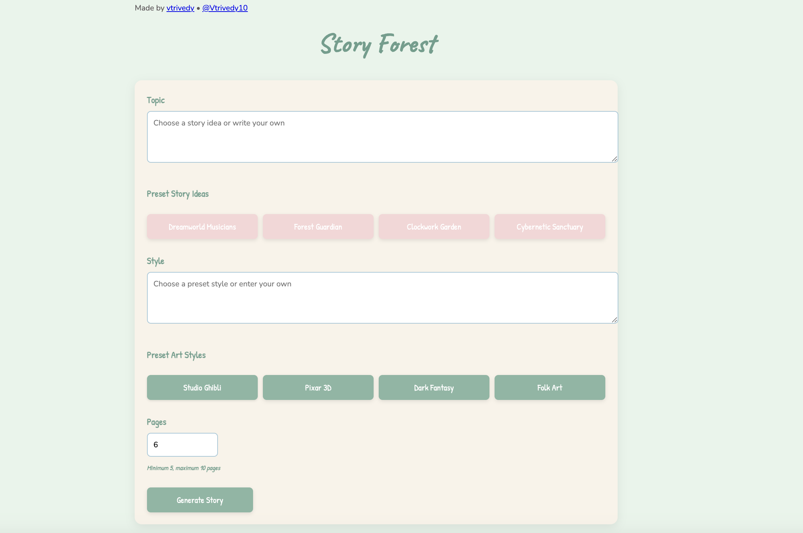

# Welcome to Story Forest!



This is a fun illustrated storybook generation tool that uses OpenAI's language and image generation models.

## Overview

This tool uses OpenAI's powerful language and image generation models to create complete storybooks with:
- Story narratives written by GPT-4.1
- Character concepts and descriptions
- Character reference images
- Cover image
- Illustrated pages

All generated content is saved in the `stories` folder organized by story title.

### Example Storybook

Watch an example of a generated storybook:


## Tech Stack

- **Backend**: Python with FastAPI for the server
- **Frontend**: HTML, CSS, and vanilla JavaScript
- **AI Services**: OpenAI's GPT-4.1 for text generation and gpt-image-1 for image generation

## Requirements

- Python 3.7+
- OpenAI API key with access to GPT-4.1 and gpt-image-1 models

## Installation

1. Clone this repository:
```bash
git clone https://github.com/vtrivedy/storyforest
cd storyforest
```

2. Set up a virtual environment (recommended):
```bash
# Create the virtual environment
python -m venv venv

# Activate the virtual environment
# On macOS/Linux:
source venv/bin/activate
# On Windows:
# venv\Scripts\activate
```

3. Install the required dependencies:
```bash
pip install -r requirements.txt
```

4. Set up your OpenAI API key in a `.env` file:
```
OPENAI_API_KEY=your_api_key_here
```

## Usage

### Running the Web Application

1. Start the FastAPI server:

```bash
python server.py
```

2. Open your browser and go to:
```
http://localhost:8600
```

3. Use the web interface to generate stories by providing a topic, style, and number of pages.


### Output Structure

All generated content is saved in the `stories` directory with the following structure:

```
stories/
└── Your_Story_Title/
    ├── story.json         # Full story text and structure
    ├── refs/              # Character reference images
    │   ├── Character1.png
    │   └── Character2.png
    ├── cover.png          # Cover image
    └── pages/             # Individual story pages
        ├── page_01.png
        ├── page_02.png
        └── ...
```

## How It Works

1. **Story Generation**: Using GPT-4.1, the tool generates a complete story structure with title, characters, and page content.
2. **Character Creation**: Each character is visualized with reference images generated by gpt-image-1.
3. **Cover Creation**: A cover image is created using the character references and a cover description.
4. **Page Illustration**: Each page is illustrated based on its description and the established character references.

## The Literal Steps

1. Generate story text structure (JSON) using GPT-4.1
2. Create character reference images
3. Generate the cover image
4. Create individual page illustrations
5. All content is saved in the appropriate folders within the story directory

## Customization

You can customize various aspects of the generation process.  Check out OpenAI's Documentation for more details [here](https://platform.openai.com/docs/guides/image-generation?image-generation-model=gpt-image-1)

- Image model: `IMG_MODEL`
- Image size: `IMG_SIZE`
- Image quality: `IMG_QUALITY`

These variables are defined at the top of the `story_gen.py` file.

## Notes

- Image generation is not cheap! The generation may take some time depending on the number of pages and characters.
- Be sure to check your OpenAI API usage and rate limits!

## License

This project is licensed under the Apache License 2.0.
